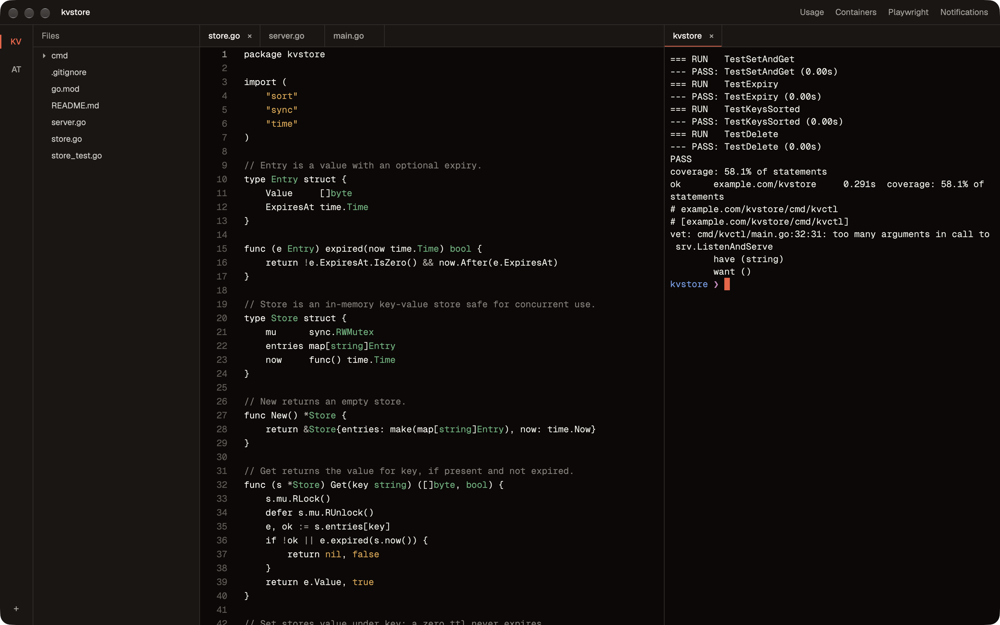
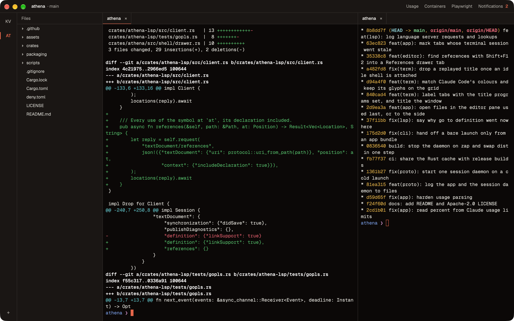
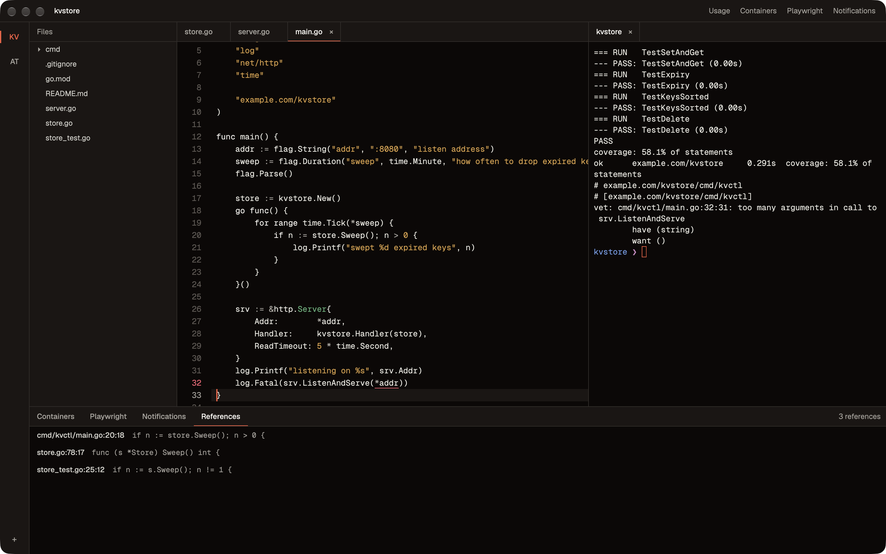

# Athena

Athena is a macOS IDE built around terminals that outlive the window and around Claude Code.
Shells run in a separate session daemon (`athena-mux`), so quitting or updating the app does not
kill them; the window reattaches on the next launch. Projects get split panes of terminals and a
terminal panel under them, an editor with language-server support that opens files in their own
encoding (and files over 50 MB read-only), a Go debugger on Delve, a git diff viewer with hunk
staging, file history and blame, a commit box and fetch, pull and push, worktrees, CI status and
pull requests through the GitHub CLI, a test runner for Go, Vitest and Jest, a browser preview, and
read-only views of Playwright results and Docker containers. Claude Code sessions show their state
and todo progress on the tab, a Claude tab lists each session's changed files, cost estimate and
plan with Resume, each file Claude edits can be reviewed as one diff against the version from
before the session, and an MCP server lets Claude read the editor, language servers, tests, the
debugger and terminals.
Optionally Athena also acts as Claude Code's IDE: Claude's proposed edits open as diffs to accept
or reject, and the editor selection goes with each prompt.

It is written in Rust on [GPUI](https://crates.io/crates/gpui) and runs only on Apple silicon.



## Install

Requires Apple silicon and macOS 26 (Tahoe).

```sh
brew tap tlsc-eng/athena
brew install --cask athena
```

The cask installs `Athena.app` and links the `athena` command onto your `PATH`. The app is
ad-hoc signed without a Developer ID, so the cask removes the quarantine attribute after install;
a copy downloaded by hand from the releases page is refused by Gatekeeper until you do the same
(`xattr -dr com.apple.quarantine /Applications/Athena.app`).

`brew uninstall --zap --cask athena` also stops the session daemon (its shells are hung up) and
deletes `~/Library/Application Support/athena`. A plain uninstall or upgrade leaves the daemon and
its shells running.

## Features

**Terminals**



- Shell sessions are owned by `athena-mux`, which keeps running when the window closes. Restored
  tabs reattach to the same shells with their scrollback.
- Split panes right and down, zoom a pane, move focus between panes with the keyboard.
- A terminal panel under the panes, as in VS Code: ``ctrl-` `` shows the drawer's **Terminal** tab
  and focuses it (opening a terminal if there is none), or hides it when it has focus;
  ``ctrl-shift-` `` opens another. The tab's header has New Terminal, Move to Editor Area and Kill;
  once there are two, the panel lists its terminals on the right as sub-tabs, whose right-click
  menu has Move into Editor Area, New Terminal and Kill Terminal. A terminal moves between the
  panel and the editor area, keeping its shell, through those menus (a terminal tab's menu has
  Move Terminal into Panel), the View menu, the palette's **Terminal:** commands, or by dragging
  a sub-tab onto a pane or a terminal tab onto the panel.
  Panel terminals belong to the daemon like any other and come back on the next launch, the
  drawer open on them if it was open when Athena quit. With the
  keyboard in a panel terminal, `cmd-w` closes that terminal rather than the editor area's tab.
  Claude Code and the MCP tools see panel terminals too, and a notification still leads to its
  terminal after it moves.
- zsh shell integration (OSC 133) marks commands; one that runs longer than 10 seconds posts a
  notification when it finishes. `ATHENA_NOTIFY_AFTER_SECS` changes the threshold and
  `ATHENA_SHELL_INTEGRATION=0` turns the integration off; set them in the environment the daemon
  starts from, e.g. `open -a Athena --env ATHENA_NOTIFY_AFTER_SECS=30`.
- With those marks each prompt gets a dot in the left margin (the success colour, red after a
  non-zero exit, an outline while the command runs); `cmd-up` and `cmd-down` scroll the previous
  or next prompt to the top, and **Copy Last Command Output** (right-click menu or command
  palette) copies what the last command printed. Other shells can send the same marks; for bash,
  add this to `~/.bashrc` (VS Code's OSC 633 spelling works too):

  ```bash
  if [[ "$TERM_PROGRAM" == "athena" ]]; then
    __athena_preexec() {
      [[ $__athena_quiet == 1 || $BASH_COMMAND == __athena_* ]] && return
      __athena_quiet=1 __athena_ran=1
      printf '\e]133;C\a'
    }
    __athena_precmd() {
      [[ $__athena_ran == 1 ]] && printf '\e]133;D;%d\a' "$__athena_status"
      __athena_quiet=0 __athena_ran=0
      printf '\e]133;A\a'
    }
    PROMPT_COMMAND="__athena_status=\$?;__athena_quiet=1;${PROMPT_COMMAND:+$PROMPT_COMMAND;}__athena_precmd"
    trap '__athena_preexec' DEBUG
  fi
  ```
- If a new version cannot attach to the shells of an older session daemon, their tabs are marked
  **stale**: **Restart sessions** ends those shells and starts new ones, **Keep** leaves them
  running and reconnects once the old daemon exits.
- Tabs take the title programs set (OSC 0/2), so a Claude Code tab shows its session name; the
  window title follows the active tab.
- Find in the terminal (`cmd-f`): searches scrollback and screen, highlights every visible match,
  shows "3 of 17", with match-case and regex toggles (both off by default).
- Programs that ask for the mouse (vim, htop, lazygit, tmux) get clicks, drags and the wheel;
  hold Shift to select text instead, Cmd still opens links.
- `cmd-k` clears scrollback; under a running program (a dev server, `tail -f`) it also clears the
  screen above the cursor line instead of sending ^L to that program.
- File references in the output are links: hold Cmd to underline one, Cmd+click to open the file
  in the editor at that line and column. This covers `go build`/`vet`/`test`, `tsc` (plain and
  `--pretty`), eslint headers, cargo and rustc arrows, Rust panics, Python tracebacks and Claude
  Code's own `path:line` mentions, plus OSC 8 `file://` hyperlinks to regular files. Paths resolve
  against the shell's current folder, then the project; a bare relative name (Go test output is
  relative to the package) is looked up in the project, and Go to file opens when several files
  match.

**Editor**



- Syntax highlighting for 21 languages (see [Languages](#languages)), each token class in its own
  colour, and the bracket matching the one at the cursor highlighted.
- Bracket pairs coloured by nesting depth, as VS Code does by default: three colours in turn
  (gold, orchid and blue in the dark theme; blue, green and brown in the light one). Brackets
  inside strings and comments are skipped and a closer with no opener keeps its usual colour;
  sticky scroll headers are coloured the same way. `"editor.bracketPairColorization.enabled":
  false` (or `"bracket_pair_colorization": false` in `"editor"` or a `"[lang]"` block) turns it
  off.
- Find and replace in file (`cmd-f`, `cmd-alt-f` for the replace row): Enter in the replace field
  replaces the current match and moves on, `cmd-enter` or **Replace All** replaces every match,
  each as one undo step. The find field has VS Code's Match Case, Match Whole Word and Use Regular
  Expression toggles (`Aa`, `ab`, `.*`, or `cmd-alt-c`, `cmd-alt-w`, `cmd-alt-r` while the bar
  has focus; bare Alt is left for typing ç, ∑ and ®), which stay set when the bar closes. An
  invalid regex turns the field red with a one-line error. In regex mode the replacement fills in
  `$1`, `$&`, `\n` and `\t`; a `$2` the regex has no group for stays as typed. `cmd-d` follows the
  toggles while the bar is open.
- Toggle comment, undo/redo, go to line (`line`, `line:column` or `line,column`).
- Indenting: Tab on a selection spanning lines indents them, Shift+Tab, `cmd-]` and `cmd-[`
  indent and outdent to the next tab stop in the file's style, skipping empty lines. Tab on a
  selection inside one line still replaces it, as in VS Code.
- Brackets and the language's quotes close themselves before blanks and closers, but not after a
  word (apostrophes) or inside strings and comments. Typing the closer steps over one that was
  inserted for you, Backspace right after an inserted pair removes both halves, and typing an
  opener with a selection surrounds it. Enter between a bracket pair opens an indented line.
- Line operations: move lines up or down, copy them up or down, delete them, insert a line below
  (keys under [Keyboard shortcuts](#keyboard-shortcuts)); Insert line above is in the palette
  only.
- Multiple cursors, with VS Code's keys: `cmd-d` selects the word at the caret, then adds its
  next occurrence (whole word and case-sensitive when started from a bare caret), `cmd-k cmd-d`
  skips to the next one instead, `cmd-shift-l` selects every occurrence, `cmd-alt-up` /
  `cmd-alt-down` add a caret above or below, Alt+click adds or removes a caret and Shift+Alt+drag
  selects a column. Escape goes back to one caret. Typing, deleting, pasting, line operations,
  indenting, comments and completion happen at every caret as one undo step; a paste with as many
  lines as there are carets puts one line at each. Copy and Cut take whole lines only when no caret
  has a selection. Hover, signature help, rename, code actions and bracket matching follow the
  primary caret. The same commands are in the **Selection** menu and, with an editor focused, the
  command palette. In an editor `cmd-d` and `cmd-alt-up` / `cmd-alt-down` are these commands
  rather than Split right and Focus pane up / down (terminals keep those).
- Word wrap: `alt-z` (or View > Word Wrap) wraps the tab's long lines at the edge of the pane,
  after a blank where there is one, with continuation rows indented like their line. Up and Down
  move by screen row, Home and End stop at the row's edges first, and the line number is shown on
  a line's first row only. Tabs that have not chosen follow **Toggle Word Wrap by Default** (File
  menu or palette, off to begin with); Markdown files wrap unless their tab turns it off or a
  `"[markdown]"` block sets `"word_wrap": false`.
- Sticky scroll: the header lines of the blocks around the top of the view (a function, an
  `impl`, a class) stay pinned above the code, outermost first, at most five and never more than
  a third of the view. Clicking one jumps to it.
- Indentation guides, one per indent step (blank lines continue the block's guides; offside for
  Python and YAML), with the guide of the cursor's block drawn brighter. Spaces and tabs inside the
  selection are shown as dots and arrows.
- Zoom editor and terminal text together with `cmd-=` / `cmd--` / `cmd-0` (1 px steps, 6 to 40 px,
  default 13 px; also in the View menu). The zoom is saved with the workspace.
- Zoom the whole interface with `cmd-alt-=` / `cmd-alt--` / `cmd-alt-0` (View > Zoom Interface In
  / Out / Reset Interface Zoom, or the palette): text, tabs, tree and drawer rows, the title and
  status bars, menus, buttons and toasts grow together in 10% steps, from three steps down to
  five up. Code text keeps the size the keys above give it. The level is saved with the
  workspace; `"window": { "zoom_level": 1 }` in settings.json sets it, and the keys update it
  there once the file has it. With macOS's Accessibility Zoom keyboard shortcuts on, the system
  takes these keys first.
- A status bar under the panes shows the project's branch (click: switch branch) and, for the
  focused editor, `Ln N, Col M` with the selected character count, or "3 selections (15
  characters selected)" with several carets (click: go to line), the indentation (click: indent
  with 2, 4 or 8 spaces or tabs, or convert the file's indentation),
  the file's encoding (`UTF-8`, `UTF-16 LE`, `Shift JIS`…; click: Reopen with Encoding or Save
  with Encoding, see below), `LF` or `CRLF` (click: convert every line break to the other, as one
  undo step), the
  language (click: highlight as another language) and a dot for its language server (starting,
  running or failed; hover for the program). Beside the branch a sync cell shows the commits to
  pull and push (see Git below).
- Code folding by brackets, falling back to indentation: chevrons in the gutter on hover, fold
  and unfold at the cursor or everywhere with the `cmd-k` chords below.
- With a language server: diagnostics, go to definition, find references (listed in a drawer
  tab; clicking a row opens the file at that line), hover docs (rest the pointer on a word for
  half a second), completion as you type (Up/Down to move, Enter or Tab to accept, Escape to
  close; accepting can also add an import) and signature help while typing call arguments.
  The selected suggestion's documentation shows beside the list; servers that send it only on
  request (typescript-language-server) are asked as an item is selected, and an import such an
  item adds (TypeScript's auto-imports) is applied on accept, or as soon as it arrives if
  nothing was typed in between.
- Completion snippets keep their tab stops: Tab moves to the next placeholder and Shift+Tab to
  the previous one, a placeholder used in several places gets a caret in each so they are typed
  together, and `$0` (or the snippet's end), Escape or Tab once the caret has left the snippet
  ends it.
- Your own snippets, in VS Code's format, join the suggestions after the language server's (see
  [Snippets](#snippets)).
- Once the cursor rests for 250 ms on a symbol, the language server's other uses of it are marked:
  reads in the find-match colour, writes in a stronger one. The marks follow edits until the next
  answer.
- Breadcrumbs under the tab strip name the file folder by folder, then the symbols holding the
  cursor (from the language server). Clicking a folder or the file lists that folder's entries,
  folders first; clicking a symbol lists the symbols beside it, and choosing one jumps there.
- Inlay hints (parameter names, inferred types) inside the line, when the language server sends
  them; gopls and typescript-language-server send none until asked, so they stay hidden until
  **Toggle inlay hints** or an `lsp` setting asks for some (see [Settings](#settings)). With word
  wrap on, each hint sits on the row it belongs to: at a wrap point a type hint ends the row above
  and a parameter name starts the next one, and hints that would push a row's text past the edge
  are left out rather than hide code.
- Semantic highlighting, as VS Code's `editor.semanticHighlighting.enabled` (on by default): gopls
  and typescript-language-server colour names over the tree-sitter colours. Only names take the
  server's colour: parameters and type parameters get colours of their own in both themes,
  read-only variables show as constants and standard-library variables as builtins, while
  keywords, strings, numbers, comments and operators keep the finer tree-sitter colours. The
  server is asked again 300 ms after typing pauses; meanwhile the colours move with the edits.
  gopls is asked for them through its `semanticTokens` setting unless your `gopls` settings set
  it. `"editor.semanticHighlighting.enabled": false` (also per language) turns them off.
- Code lens: a language server's lenses are drawn in muted text after their line, as gopls's
  **run go generate** on a `//go:generate` line (and **run test** once `"lsp": {"gopls":
  {"codelenses": {"test": true}}}` asks for it), or typescript-language-server's reference and
  implementation counts once `typescript.referencesCodeLens.enabled` or
  `typescript.implementationsCodeLens.enabled` is set (in a project's `.vscode/settings.json`, or
  under the server's `lsp` entry as `{"typescript": {"referencesCodeLens": {"enabled": true}}}`).
  They are asked for around the lines on screen once typing or scrolling pauses. Clicking one
  runs its command on the server (a failure shows as a notice), or lists a reference count's
  locations in the References tab; a lens whose command neither applies is shown but not
  clickable. A server command builds or runs the project's code, so it runs only once the
  project's code is allowed (see [Languages](#languages)); reference lists open at once.
  `"editor.codeLens": false` (also per language) hides them.
- Renaming or moving a file or folder in the tree (its name field, or a drag) lets the language
  servers that ask for it take part, as VS Code's file participants: typescript-language-server
  is sent `workspace/willRenameFiles` first and its edit, the imports that name the file updated
  to its new place, is applied before the file moves (asking first when it reaches more than one
  file: **Update Imports** or **Don't Update**); servers that ask then hear
  `workspace/didRenameFiles`. A server that takes more than 5 seconds is not waited for. gopls
  does not take part, so Go files simply move.
- Also with a language server: rename symbol (`f2` opens a field over the symbol with the old name
  selected; Enter renames it in every file, open files as one undo step each and closed files saved
  to disk), quick fixes and refactorings (`cmd-.` lists them in a menu at the cursor, preferred
  fixes first), go to implementation (`cmd-f12`) and go to type definition (editor menu and
  palette). A dot in the gutter marks the cursor's line when a diagnostic there has a quick fix;
  clicking it opens the same menu. Several implementations are listed in the References tab.
- An **Outline** view: the Explorer / Outline switch at the top of the tree area (or the
  palette's **Focus outline**) lists the active editor's symbols as a tree, highlights the one
  holding the cursor and follows it, opens a symbol on click, folds with the chevrons, and filters
  by name as you type (Up/Down pick, Enter opens, Escape clears).
- Call hierarchy (`shift-alt-h`, the editor menu or the palette): the callers of the function at
  the cursor in the References tab as a tree; Incoming / Outgoing in the tab's header switches to
  the functions it calls, a chevron (or a double click) loads the next level, and a row opens the
  call site. **Show type hierarchy** (palette) does the same for the type at the cursor: its
  subtypes, or with Supertypes in the header the types it extends or implements (gopls answers
  for interfaces and the types implementing them).
- Expand and shrink selection (`ctrl-shift-cmd-right` / `ctrl-shift-cmd-left`): every caret's
  selection grows through the syntax around it as the language server sees it (gopls and
  typescript-language-server), or by word, line text, line and file without one; shrinking steps
  back through the same selections.
- Format selection (`cmd-k cmd-f`) formats the selection, or the cursor's line, when the server
  can format part of a file (typescript-language-server can; gopls formats whole files only and
  says so).
- Linked editing (`"editor": { "linked_editing": true }`, off by default as in VS Code): in TSX
  and JSX, typing in an element's tag name renames its closing tag too, as one undo step; a space
  or any character a tag name cannot hold ends it.
- Go to symbol in the file (`cmd-shift-o`, or `@` in Go to file), previewing each one as the
  selection moves and going back on Escape, and in the workspace (`cmd-alt-o`, or `#`). `>` in Go
  to file switches to commands.
- A **Problems** drawer tab lists the project's errors, warnings and infos grouped by file, errors
  first, with a count on the tab; clicking a row opens the file there. `f8` / `shift-f8` in an
  editor step to the next or previous problem across files, and `cmd-shift-m` or the
  error/warning counter in the title bar toggles the tab.
- Format on save: `cmd-s` asks the language server to format the file first, by default in Go
  files only; for Go it also organizes imports. "Toggle format on save" (palette, File menu) turns
  it on or off for every language with a server, except that Go keeps formatting until a
  `"[go]"` block turns it off (see [Settings](#settings)). Auto save does not format.
- Trim trailing whitespace and insert a final newline on save: off by default, as in VS Code, and
  turned on in settings.json or `.editorconfig`, as one undo step. Trimming leaves blanks inside
  multi-line strings (raw strings, template literals, docstrings, heredocs, YAML block scalars),
  and an auto save leaves them on any line where a tab of that file has a caret.
- `.editorconfig` files are read from the file's folder upwards until one says `root = true`;
  nearer files and later sections win and `unset` clears a property. `indent_style` and
  `indent_size` set the indentation when the file opens; `end_of_line`,
  `trim_trailing_whitespace` and `insert_final_newline` apply on save and win over settings.json.
- Go to file (fuzzy) and a command palette. A file opens in the editor pane used last, or in a
  new pane beside the focused one with Cmd+click in the tree or Cmd+Enter in Go to file.
- Two tabs on the same file share one buffer: edits, undo and the unsaved marker are the file's;
  each tab keeps its own cursors, scroll, folds and word wrap.
- Auto save one second after you stop typing (palette: "Toggle auto save"), unsaved markers on
  tabs, tree rows and the window title, Save As, and a Reload / Overwrite bar when a file changes
  on disk while you have unsaved edits (unchanged files just reload). Project folders are
  watched, so changes made outside Athena show up without switching windows.
- Markdown and Mermaid preview (`cmd-shift-v`) for `.md`, `.markdown`, `.mdx`, `.mmd` and
  `.mermaid`: tables, task lists, local images and links, ```` ```mermaid ```` blocks. It follows
  unsaved edits as you type and re-renders on save.
- Images (PNG, JPEG, GIF, WebP, BMP, TIFF, ICO, SVG) open in a viewer that fits and zooms.
- Files open in their own encoding. Detection takes UTF-8 (with or without a byte order mark),
  UTF-16 LE or BE with a byte order mark, Shift JIS or EUC-JP when the bytes read cleanly as text
  with kana, and otherwise Windows 1252, which reads and writes back any byte. The text is held
  without the byte order mark, and saving writes it back in the same encoding with the mark and
  line breaks the file had, so bytes nobody edited stay the same. A file whose bytes do not
  survive decoding (a broken UTF-16 tail, or an encoding you picked that does not fit), or text
  with a character the encoding has no bytes for, refuses to save with the reason; the text is
  encoded before the file is opened for writing, so a refused save leaves the file untouched.
  Binary files are still refused. Click the encoding in the status bar for **Reopen with
  Encoding** (read the file again as another encoding; this drops the tab's undo history, so undo
  cannot bring back text decoded the old way) or **Save with Encoding** (write it in another one),
  each listing UTF-8, UTF-8 with BOM, UTF-16 LE / BE, Windows 1252 and 1250, ISO 8859-2, Windows
  1251, KOI8-R, Shift JIS, EUC-JP, GBK, Big5 and EUC-KR. A picked encoding is kept across reloads.
  Cyrillic, Chinese and Korean files are not detected (only Japanese is); they open as Windows
  1252 until you reopen them in their encoding.
- Files over 50 MB, up to 2 GB, open in a read-only large-file view instead of the editor. It
  reads the file in pages as you scroll and builds a line index in the background, so the file is
  usable at once; a banner shows the indexing progress, then the line count, and says what the
  view leaves out: highlighting, the language server, folding and the git gutter. Lines end at LF,
  CRLF or a lone CR; a line longer than 16 KB is cut off, tabs are expanded and control
  characters are drawn as their Unicode pictures. Scroll with the wheel, the arrows, Page Up /
  Down, `cmd-up` / `cmd-down` or the scrollbar; `cmd-f` finds, ignoring case, over the whole file
  in the background, wrapping at either end. There is no selection or copy. The view reloads when
  the file changes; the tab is saved as an editor tab, so a file that has shrunk below 50 MB
  opens in the editor the next time. Larger files
  and binary files are refused.
- A minimap at the editor's right edge, as in VS Code: each row two pixels tall, each run of
  characters a block in its token's colour, the caret's line tinted and a slider over the rows on
  screen. Drag the slider, or press elsewhere to centre that row and drag from there. It follows
  folds and word wrap, and hides in panes narrower than 520 px. **Toggle minimap** (palette, or
  View > Toggle Minimap) writes `"editor.minimap.enabled"`; `false` there (or `"minimap": false`
  in `"editor"` or a `"[lang]"` block) turns it off.
- File-type icons from [seti-ui](https://github.com/jesseweed/seti-ui) in the tree and on tabs.

**Git**

Needs the Xcode command line tools (Athena runs `/usr/bin/git`; without the tools it shows no git
information rather than triggering the install dialog).

- Tree rows and tab labels take the file's status colour (modified, added, untracked, deleted,
  conflicted, ignored), tree rows also show the status letter, and folders take the most severe
  status inside them.
- The editor gutter marks added, modified and removed lines of the saved file against the index,
  as VS Code's quick diff does, so staging a change clears its bar. UTF-16 files, which git diffs
  as binary, get their marks from Athena's own line diff of the two decoded texts.
- Quick diff peek: clicking a change bar, or `alt-f3` / `shift-alt-f3` from the cursor, opens a
  peek under the change with the index's lines for it in red and **Stage**, **Revert**, previous,
  next and close buttons; Escape closes it. It diffs the buffer, unsaved edits included, and
  follows edits while open. Revert is an undoable edit; Stage writes only that change to the
  index and refuses if the index changed meanwhile. The index's copy is read and staged in the
  editor's encoding, keeping the byte order mark the index's copy has. A file that goes through a
  `filter` attribute (Git LFS, git-crypt) or a `working-tree-encoding` attribute (git keeps it as
  UTF-8 and writes it out in another encoding) gets a message to stage or revert the whole file
  instead, as hunk staging does.
- Inline blame (`cmd-alt-shift-g`, off by default): "author · 3 days ago · summary" after the
  cursor's line, "Not committed yet" for edited lines.
- File blame (**Git: Toggle file blame** in the palette, or View > Toggle File Blame) adds a
  column to the focused editor, like GitLens: an age bar on every line, brighter for newer
  commits, and the author and age where each commit's lines start. Hovering shows the commit's
  author, age, id and summary; clicking opens what that commit did to the file (through renames),
  or the uncommitted changes for lines not committed yet. Unsaved edits are blamed after a 500 ms
  pause and on save.
- Timeline (**Git: Open timeline**, or View > Open Timeline): a drawer tab listing the active
  file's commits through renames, newest first, with subject, author and age (the id in a
  tooltip), following the active tab. Clicking a commit opens what it did to the file against
  its parent; **Compare with Current** on the row or its right-click menu compares that version
  with the working tree. It lists at most the last 500 commits.
- A **Changes** drawer tab lists Staged Changes, Changes and Untracked, with Stage / Unstage on
  each row and group (Stage All and Discard All leave conflicted files alone). Hovering a row also
  offers Open File and Discard.
- Clicking a row opens its diff in a tab: a staged row compares `HEAD` with the index ("main.go
  (Index)"), an unstaged or untracked one the index with the file on disk ("main.go (Working
  Tree)"); a conflicted file opens in the editor instead. Diffs are read-only, side by side or
  inline (toolbar switch), syntax highlighted, with changed words marked inside changed lines.
  `alt-f5` / `shift-alt-f5` step through the changes. Above each change, **Stage**, **Unstage** or
  **Revert** acts on that change alone; a staging action is refused if the index changed since
  the diff was made, and Revert refuses a file that changed since. Open diffs reload when git
  status is re-read. Every version (`HEAD`, the index, the disk, a commit, Claude's snapshot) is
  decoded as the editor decodes files, so a Shift JIS or UTF-16 file shows its real changes; a
  side that could only be guessed as Windows 1252 is read in the other side's encoding when it
  fits that byte for byte. Stage, Unstage and Revert write a hunk back in that encoding, and only
  when both versions are in the same encoding and each decoded without loss; otherwise they are
  refused with the reason, so no hunk changes bytes outside itself. Blame of unsaved text sends
  git the bytes a save would write. Binary files and files over 20 MB show why there is no diff,
  and Compare Changes on a merge conflict needs a UTF-8 file.
- In a diff, drag to select text on either side (Shift+click extends); `cmd-c` copies only that
  side's lines, including any inside hidden regions, and `cmd-a` selects everything. **Hide
  Unchanged** in the toolbar folds unchanged stretches down to three lines around each change,
  each fold a bar that opens on click; it starts on for diffs over 500 rows. Right-click offers
  Copy, Select All, the change's Stage, Unstage or Revert This Change where the diff allows it, and
  Open File.
- Compare two files: **Select for Compare** on a file in the tree's right-click menu, then
  **Compare with Selected** on another opens a side-by-side diff, the selected file on the left.
- A commit box above the list takes several lines: Enter breaks the line, `cmd-enter` or
  **Commit** commits, paste keeps line breaks, and the box grows to six rows before it scrolls.
  **Amend** fills in the last commit's whole message and refuses to commit if `HEAD` moved since.
  With nothing staged it offers to stage everything and commit. **Discard** asks
  first: tracked files go back to their staged or committed version, untracked ones move to the
  Trash. Discard and Revert keep a copy of the replaced file in
  `~/Library/Application Support/athena/discarded` for 30 days.
- Merge conflicts: a conflicted file's `<<<<<<<` blocks are tinted as in VS Code (current green,
  incoming blue, a diff3 base grey), and a row after each `<<<<<<<` line offers **Accept Current
  Change**, **Accept Incoming Change**, **Accept Both Changes** (one undo step each, keeping CRLF
  and a missing final newline) and **Compare Changes** (a diff tab of every block resolved to
  each side). A block with another `<<<<<<<` inside gets no actions. The Changes tab header says
  "2 conflicts in 1 file"; marker lines left outside any block still count as a conflict. Saving a
  conflicted file with no conflicts left offers a **Stage** toast to mark it resolved.
- **Switch branch…** (palette, the branch button by the commit box, or the branch in the status
  bar) lists local then remote branches with their age and last subject. Typing a new name offers
  to create it; a remote branch without a local one is checked out tracking it. Switching is never
  forced, so git's refusal over local changes is shown as is. After the branches it lists
  **Stash changes**, **Stash changes (include untracked)** and one **Pop stash@{n}** row per
  stash; the stash that was picked is the one popped even if the list renumbered meanwhile.
- Fetch, pull and push: the status bar's sync cell beside the branch shows "↓2 ↑1" against the
  upstream, **Publish** when the branch has none, or "Pulling…" while one runs. Clicking it offers
  Pull and Push (or Publish Branch), Fetch, Stash Changes, Stash Changes (Include Untracked) and
  Pop Stash…; the palette has the same as **Git: Fetch**, **Git: Pull**, **Git: Push**, **Git:
  Stash**, **Git: Stash (include untracked)** and **Git: Pop stash…**. Pull is `git pull
  --ff-only`, so diverged branches are refused with git's own message. Publish Branch asks first
  and runs `git push -u` to `origin`, or to the only remote. One fetch, pull, push or stash runs at
  a time; another is refused with a toast. A branch whose upstream was deleted shows nothing to
  pull or push.
- Git never waits on a prompt: remote commands run with `GIT_TERMINAL_PROMPT=0`,
  `GIT_ASKPASS=/usr/bin/true`, `SSH_ASKPASS_REQUIRE=never` and `ssh -o BatchMode=yes` (unless you
  set `GIT_SSH_COMMAND`, `GIT_SSH` or `core.sshCommand`, which are left as they are), in a session
  of their own without a terminal, so a password or passphrase prompt fails at once. Use an ssh
  agent or a credential helper. A remote command is stopped after 5 minutes, ssh included.
- Reading a repository never runs a command its config names. For status, the gutter, the peek,
  blame, the timeline and stored versions, Athena switches off every configured filter driver
  (clean, smudge and process), passes `--no-textconv` and turns `log.showSignature` off, so
  opening a cloned repository cannot run its drivers; built-in line-ending conversion still
  applies. Drivers configured inside a submodule are not covered yet: git status, which looks
  into submodules, can still run them. Commands that write (staging or discarding a whole file,
  switching branches, stash, pull, commit and its hooks) run the filters as git would, since
  skipping them would store or check out the wrong bytes; hunk staging, unstaging and reverting
  are refused for a filtered file, and for one with a `working-tree-encoding` attribute, for the
  same reason.
- Autofetch (`"git": {"autofetch": true}` in [settings.json](#settings), off by default as in VS
  Code) fetches the active project every three minutes while the window is in front.
- Worktrees: **Git: Open worktree…**, **Git: Create worktree…** and **Git: Delete worktree…** in
  the palette, and **Create worktree…** in the branch picker. A new worktree checks out a new
  branch made at `HEAD`, a local branch no other worktree has, or a remote branch as a new
  tracking branch; it is made beside the main worktree as `<repo>-<branch>` and opens as a
  project. Picking a branch that another worktree has checked out opens that worktree instead of a
  switch git would refuse. In the project rail, linked worktrees sit right after their main
  repository, joined to it by a short line ("worktree of …" in the tooltip). Deleting is refused
  while a project is open in the worktree or a folder inside it, or a terminal (Claude's included)
  sits in it; one with uncommitted or untracked changes is deleted only after **Delete Anyway**,
  and one whose folder is already gone can still be removed. The worktree's branch is kept.
- GitHub, through the [GitHub CLI](https://cli.github.com) (`gh`) when it is installed and signed
  in to github.com: a dot in the status bar for the latest workflow run on the current branch
  (amber while it runs, green or red when it passed or failed, grey when cancelled or skipped;
  the tooltip names the workflow and commit, a click opens the run), read when a branch is first
  seen, every two minutes while the window is in front and after a fetch or push. **GitHub:
  Create pull request** runs `gh pr create --web`, which opens GitHub's form in the browser and
  writes nothing; a branch without an upstream or with unpushed commits is stopped with a notice
  first, so gh never pushes it. **GitHub: View pull request checks** lists the pull request's
  checks in the palette, failures first, each opening its run.
- gh never prompts: it runs with `GH_PROMPT_DISABLED=1`, no stdin, in a session of its own
  without a terminal, with pager and update notices off, and is stopped after 20 seconds (60 for
  Create pull request). It is looked up on the login shell's `PATH`, then in Homebrew's folders,
  and git commands it runs get `core.fsmonitor=false`. Without gh, or signed out of github.com,
  the dot stays hidden and the two palette entries say in one line what is missing ("Needs gh:
  brew install gh", "Needs gh auth login"); Athena checks again every two minutes, so a fresh
  `gh auth login` is picked up.
- Status is re-read every 5 seconds while the window is in front and shortly after a save, a file
  operation or a change on disk. The title bar and the status bar show the branch.

**Workspace**

- Find and replace in project (`cmd-shift-f`): a Search drawer tab honouring `.gitignore` and
  skipping binary files and files over 1 MB; up to 2000 matches. Up/Down walk the matches, Enter
  opens one. It has the editor's three toggles and keys (`cmd-alt-c`, `cmd-alt-w`, `cmd-alt-r`);
  with Match Case off, case does not matter even when the query has capitals, as in VS Code. The
  `⋯` button shows **Files to include** and **Files to exclude**: comma-separated globs that match
  at any depth unless they start with `./`, a folder standing for everything in it. An invalid
  regex or glob turns its field red and shows the error in place of results. Each project keeps
  its query, fields and results while the app runs.
- With text in the replace field, clicking a match opens a Replace Preview diff tab of that file,
  which follows the replace text. **Replace All** fills in `$1`, `$&` and `\n` in regex mode, runs
  only for finished results of the query in the field, asks first, then replaces in open editors
  (one undo step each) and on disk. When the results stopped at 2000 it refuses ("Too many
  results to replace safely") rather than rewrite files you have not seen; narrow the search or
  the files to include.
- Right-click menus. Tree: New File, New Folder, Rename, Delete (to the Trash), Reveal in Finder,
  Copy Path, Copy Relative Path, Open to the Side, and on files Select for Compare / Compare with
  Selected. Tabs: Close, Close Others, Close to the Right, Close All, Move Terminal into Panel (on
  a terminal), Reveal in Finder, Copy Path, Copy Relative Path, Reveal in File Tree, Split Right /
  Down with that tab. Editor: Go to Definition, Find References, Go to Implementations, Go to Type
  Definition, Show Call Hierarchy, Rename Symbol, Quick Fix…, Cut, Copy, Paste, Toggle Line
  Comment. Terminal: Copy, Paste, Select All, Find, Clear. Panel terminal rows: Move into Editor
  Area, New Terminal, Kill Terminal. Diffs and Timeline rows have their own (see Git above).
- Drag a tab onto another tab or strip to move it, onto the middle of a pane to join it, or onto
  an edge of a pane to split it there; the terminal or editor keeps running. Drop a folder from
  Finder to open it as a project, a file to open it in a tab.
- Drag a file tree entry onto a folder to move it there (onto a file means that file's folder,
  onto the empty tree the project folder); hold Option to copy instead, named "name copy.ext" when
  the name is taken, in the background. As in VS Code a move asks "Are you sure you want to move …
  into …?" first; **Move and Don't Ask Again** writes `"explorer": { "confirmDragAndDrop": false }`
  into settings.json, and setting it back to `true` brings the question back. When the name is
  taken the move asks to replace, and the entry it replaces goes to the Trash; its tabs close.
  Open tabs of the moved files follow it, unsaved edits kept, the tree shows the new place and git
  status refreshes. Some drops are refused: into the entry itself or a folder inside it, a
  replace whose target holds the entry (dragging `pkg/pkg` up beside `pkg` would trash the folder
  it sits in), and a replace of a file with unsaved changes (save or close it first). Dropping
  into the folder the entry is already in, or letting go of a folder over its own row, does
  nothing. Between volumes a move copies, then sends the original to the Trash.
- Back and forward through visited tabs and cursor positions (mouse buttons 4 and 5, `ctrl--` /
  `ctrl-shift--`, View menu); in a browser preview they walk the page's history.
- The tab strip scrolls sideways when tabs overflow; a middle click closes a tab.
- Drag the file tree's right edge or the drawer's top edge to resize them (double-click restores
  240 px); double-click a divider between panes to split the space evenly. Sizes are saved.
- Panels, tabs, panes, the palette, menus, toasts and find bars fade in and out; with Reduce
  Motion on they appear at once.

**Tests and tasks**

- Go tests (`func TestX(t *testing.T)`, `FuzzX`) in `_test.go` files and Vitest or Jest tests
  (`describe`, `it`, `test`, with `.only`, `.skip` and the like) in `*.test.*`, `*.spec.*` and
  `__tests__/` files get a green ▶ in the gutter; clicking it runs that test or group, and after
  the run it becomes a green, red or grey dot (amber while running). `.each` tests and titles built
  from template substitutions get no mark, since no fixed name matches them.
- Go subtests get their own ▶ when `t.Run` names them with a string literal, nested ones too.
  Running one asks for `-run '^TestX$/^name$'`, each level escaped and spelled as `go test`
  reports it (spaces as underscores), so only that subtest runs; a subtest that runs several times
  in a loop (`name`, `name#01`, …) runs every time and its mark shows the worst result. Several
  subtests of different tests run their whole tests.
- **Tests: run all tests with coverage** runs `go test -coverprofile` over the module at the
  project root and tints each measured line number in the gutter: green where a statement on it
  ran, red where none did. **Tests: toggle coverage** hides and shows the tints, and editing a
  file drops its coverage, since the lines no longer match the profile.
- Go runs `go test -json` from the module root. JavaScript runs `npx --no vitest run` or `npx --no
  jest` with the JSON reporter from the nearest `package.json` that depends on Vitest or Jest (or
  names it in its `test` script).
- A **Tests** drawer tab lists suites (Go packages, test files) and their tests with pass/fail
  dots, durations and a summary, with **Run All**, **Re-run Failed** and **Stop**. Clicking a test
  shows its output with `file:line` places clickable; hovering offers Run and Go to Test (and
  Debug for a Go test). A failed run opens the tab at the first failure. The palette has
  **Tests**, **Tests: run test at cursor**, **Tests: run tests in current file**, **Tests: run all
  tests**, **Tests: re-run failed tests**, **Tests: stop** and the two coverage commands.
- Runs have a 15-minute limit; Stop, the limit and quitting Athena kill the whole process group,
  test binaries and workers included.
- **Run task…** (palette) lists the project's `package.json` scripts ("npm: build", run through
  pnpm, yarn or bun when their lockfile is there) and its Makefile targets ("make: test"), and
  types the command into a new terminal tab in the project folder. Names that would not type
  safely into a shell (control characters, a leading `-`) are left out.

**Debugging (Go, with Delve)**

- Requirements: Delve (`dlv`) on your login shell's `PATH`, found as gopls is and never installed
  for you (`go install github.com/go-delve/delve/cmd/dlv@latest`; without it F5 shows that
  command). Athena runs it as `dlv dap` through the login shell, so goenv-style shims work. On
  macOS, unless Developer Mode is on, the system asks for an administrator password whenever
  Delve takes control of a program after a while; `sudo DevToolsSecurity -enable` turns Developer
  Mode on and stops it asking. A launch held up by that prompt says so in the Debug Console.
- **F5** debugs the first `"type": "go"` configuration in `.vscode/launch.json`, else the package
  of the open Go file (VS Code's "Launch Package": a `_test.go` file debugs its package's tests).
  launch.json may set `request` (`launch`; attach is refused for now), `mode` (`auto`, `debug`,
  `test`, `exec`), `program`, `args`, `env`, `buildFlags` (a string or a list) and `cwd`, with VS
  Code's `${workspaceFolder}` (or `${workspaceRoot}`), `${workspaceFolderBasename}`, `${file}`,
  `${fileDirname}`, `${fileBasename}`, `${fileBasenameNoExtension}`, `${relativeFile}`,
  `${relativeFileDirname}` and `${pathSeparator}`. Any other variable (`${env:…}` included) or
  a field of the wrong type is an error that names it. **Open Configurations** (Run menu,
  palette) opens launch.json, writing a starter if there is none.
- Debugging builds and runs the project's code, so it starts only once the project's code is
  allowed (the same answer as for its linters, see [Languages](#languages)). In a project never
  asked, F5 asks first with **Cancel** and **Allow and Debug** (Escape cancels, Return answers
  neither), before launch.json is even read; a disallowed project gets a notice naming **Allow
  project code**. Restart checks again, and disallowing a project stops its session. Unsaved
  files of the project are saved first, and Delve's binary goes to a private temporary folder
  rather than the project; quitting Athena or closing the project ends the session, kills Delve
  and removes that folder.
- Click left of a line number, or press **F9**, to add or remove a breakpoint; the pointer shows a
  faint dot where a click would add one. Right-click the gutter for **Add Conditional
  Breakpoint…**, **Add Logpoint…** (a message with `{expression}` parts, printed instead of
  stopping), **Edit Condition…** (expression or hit count, ↑↓ switches) and **Disable
  Breakpoint**. Conditional breakpoints show two bars, logpoints a square, disabled ones a grey
  ring and ones Delve could not place a red ring; one Delve places on another line moves there.
  Breakpoints move with edits above them and are kept per project, with paths relative to it, in
  `breakpoints.json`. A breakpoints file that does not parse is kept aside as
  `breakpoints.json.corrupt-<time>` rather than overwritten.
- Right-clicking a test's ▶ offers **Run Test** and **Debug Test**, Go test rows in the Tests tab
  have a **Debug** link beside Run, and **Debug: debug test at cursor** does the same from the
  keyboard; only that test (or subtest) runs.
- While paused, the line is tinted amber with an arrow in the gutter (green for a caller's frame
  picked in the call stack), its file opens there, and hovering an identifier or a selector chain
  such as `cfg.Server.Port` shows its value (or the language server's documentation when Delve
  cannot evaluate it). A panic stops on the first frame inside the project rather than in the
  runtime. Steps keep the last stop's marks and variables until the next stop.
- The title bar shows Continue / Pause, Step Over, Step Into, Step Out, Restart and Stop while a
  session runs. The **Debug** drawer tab has Call Stack (goroutines; the paused one expanded,
  runtime frames dimmed), Breakpoints (enable, open, remove, Remove All), Variables (expand
  structs, slices and maps as needed; expansion is kept across steps), Watch (expressions
  evaluated at each stop, kept per project) and the Debug Console, which shows the program's
  output (each line cut at 4 KB) and evaluates what you type in the selected frame.
- Keys: **F5** start or continue, **Shift+F5** stop, **Cmd+Shift+F5** restart, **F6** pause,
  **F10** / **F11** / **Shift+F11** step over / into / out (outside terminals), **F9** breakpoint
  (in an editor). On a Mac keyboard these need Fn unless the F-keys are standard function keys,
  and macOS takes F11 and sometimes F10 first (see [Keyboard shortcuts](#keyboard-shortcuts));
  the Run menu, the palette's eleven **Debug:** commands and the title bar's buttons work
  without them.
- Claude Code's `debug_state` tool reads where the program is paused, its stack and the selected
  frame's locals, without resuming or stepping it.

**Claude Code**

- A new Claude session opens in its own terminal tab; the command that starts Claude is asked
  once per project.
- Tabs show whether Claude is working or waiting for input. With the project's hooks enabled,
  Athena also posts a notification when a session finishes or needs you.
- An MCP server, `athena mcp-stdio`, answers from the running window (see below).
- With the project's hooks enabled, each file Claude edits posts a toast ("Claude edited main.go")
  whose **Review diff** opens the file's changes since before the session's first edit to it (see
  [Reviewing Claude's edits](#reviewing-claudes-edits)).
- The **Claude** drawer tab (palette: **Claude: Show sessions**) lists the project's recent
  sessions from `~/.claude` and every `~/.claude-*` profile: title, todo progress, messages,
  tokens and an estimated cost. A session expands to its todo list and plan and to each file it
  changed with +/− line counts; open a file's diff, step through them all with **Review All**
  (palette: **Claude: Review next/previous changed file**), or **Revert** one file to before the
  session (a copy of the current file is kept in `discarded/` for 30 days). Revert is refused
  while an editor of that file (opened through a link or not) has unsaved changes, since saving
  them would undo it; a clean editor reloads. The newest session starts expanded, and **Claude:
  Review next changed file** starts a review of it from the keyboard. **Resume** opens a terminal
  running `claude --resume <id>` in the project folder, with `CLAUDE_CONFIG_DIR` set for a
  profile other than `~/.claude`.
- Costs are estimates from built-in list prices, not a bill; models without a price show
  "cost n/a". Set your own in settings.json, in USD per million tokens:
  `"claude": { "prices": { "claude-sonnet-5": { "input": 3, "output": 15 } } }` (cache prices
  default to 1.25×, 2× and 0.1× the input price; `cache_write`, `cache_write_1h` and `cache_read`
  override them).
- Optional title-bar indicator for Claude plan usage (5-hour and weekly windows).

**Also**
- Browser preview pane (WKWebView); `3000` or `localhost:3000` opens the local dev server.
- Playwright: run a project's tests, list failures from the JSON report, open traces, and
  optionally add the Playwright MCP server for Claude.
- Containers: a read-only view of the local Docker engine (Docker Desktop or Rancher Desktop):
  list, stats and logs. Athena never starts, stops or removes containers.
- Workspace layout, open projects and tabs are restored on launch, each editor with its cursor,
  scroll position, folds and word wrap choice as they were left.
- Open Recent (`ctrl-r` outside a terminal, or File > Open Recent) lists the last 20 project
  folders you closed.
- Several windows: New Window (`cmd-shift-n`), Open Project in New Window, Move Project to New
  Window, Merge All Windows and Close Window. A project is open in one window at a time and keeps
  its terminals and unsaved text when it moves. Moving a project ends its debug session, rejects
  Claude's pending proposals for it and restarts its language servers in the window it lands in;
  merging or closing a window also stops that window's debug session and test run. A closed
  window's projects keep their shells running and stay in Open Recent until reopened; Clear
  Recently Opened asks before ending them. Settings and Keyboard Shortcuts tabs are not restored
  on launch. A v0.9 build opening the same workspace.json shows every project in one window and
  forgets closed windows' projects, leaving their shells running.
- Light and dark themes. By default Athena follows the macOS appearance and switches with it;
  View > Theme or the palette's **Theme:** commands pin light or dark. Both themes cover the
  interface, code, the terminal's 16 colours (tuned so Claude Code stays readable) and Markdown
  previews.

## Languages

| Language | Files | Language server |
|---|---|---|
| Go | `.go` | `gopls` |
| TypeScript, TSX | `.ts`, `.mts`, `.cts`, `.tsx` | `typescript-language-server`, plus the project's ESLint / Biome |
| JavaScript | `.js`, `.mjs`, `.cjs`, `.jsx` | `typescript-language-server`, plus the project's ESLint / Biome |
| YAML | `.yaml`, `.yml` | |
| JSON | `.json`, `.jsonc`, `.json5`, `.prettierrc`, `.eslintrc`, `.babelrc` | the project's Biome |
| TOML | `.toml`, `Cargo.lock`, `uv.lock`, `poetry.lock` | |
| Shell | `.sh`, `.bash`, `.zsh`, `.zshrc`, `.bashrc`, `.profile`, `.envrc` and similar, `#!` scripts | |
| Rust | `.rs` | |
| Python | `.py`, `.pyi` | |
| CSS | `.css` | the project's Biome |
| HTML | `.html`, `.htm` | |
| Markdown | `.md`, `.markdown` | |
| Swift | `.swift` | |
| Dockerfile | `Dockerfile*`, `Containerfile*`, `.dockerfile`, `.containerfile` | |
| Environment files | `.env`, `.env.*` | |
| Go modules | `go.mod`, `go.work`, `go.sum`, `go.work.sum` | |
| Makefile | `Makefile`, `makefile`, `GNUmakefile`, `.mk`, `.make` | |
| SQL | `.sql` | |
| Protocol Buffers | `.proto` | |
| Mermaid | `.mmd`, `.mermaid` | |

Highlighting uses tree-sitter grammars, except Dockerfile, `.env` and Mermaid, which use a line
scanner; Markdown's paragraphs, headings, lists and quotes are parsed again with the inline
grammar, so emphasis is italic, strong text bold, code spans coloured and links underlined.
Language servers are started only for Go and TypeScript/JavaScript, when `gopls` or
`typescript-language-server` is on your login shell's `PATH`; with one, names are coloured again
from its semantic tokens. Other languages get highlighting, folding and bracket matching without
one.

Linters run beside them when the project installs them: `vscode-eslint-language-server` (from
`vscode-langservers-extracted`) or `biome` (from `@biomejs/biome`). They are the project's own
code, so Athena never installs them and never looks for them on `PATH`: it starts one only from
`node_modules/.bin` directly under the project folder you opened, and only when that entry
resolves, symlinks followed, to a file inside that same `node_modules` (a `.bin` entry or a
`node_modules` linked in from elsewhere, or one in a parent folder, is ignored). Their diagnostics
join the Problems tab labelled with their source and rule, as `eslint(no-unused-vars)`, and their
fixes join the `cmd-.` menu. `"eslint": { "fixOnSave": true }` makes `cmd-s` apply ESLint's
fix-all first (off by default).

Since running them runs the project's code, Athena asks once per project folder before the first
start whether to allow the project's code: "Run ESLint, Biome and TypeScript from proj?" (naming
only what it installs), or "Use proj's language server settings?" for a project that brings only
such settings. One answer covers everything the project brings: its linters, its own TypeScript,
and project settings that choose what language servers run (see [Project
settings](#project-settings)); until it is allowed, the project's editor settings still apply.
The same answer covers what builds or runs the project's code: debugging, and the server commands
behind code lenses and code actions (gopls's **run go generate**, **run test**, `go mod tidy`,
add dependency). Those ask in any project not yet asked, with **Cancel** and **Allow and Debug**
or **Allow and Run**, and a refused code action changes nothing.
Only a project that brings one of them is asked, and the answer is kept with the project in
`workspace.json`. The buttons are **Don't Allow** and **Allow**: Escape is Don't Allow, Return
answers neither, and only a click (or Space on the focused button) allows. Deleting a worktree
with changes, updating imports on a rename and reverting a Claude edit ask the same way.
**Allow project code (linters, TypeScript, project settings)** and **Disallow project code
(linters, TypeScript, project settings)** in the palette change the answer for the active
project: allowing starts its linters for its open files, disallowing stops them and clears what
they reported, and either answer restarts the project's language servers with the settings it
allows.
They start without `SSH_AUTH_SOCK`, `NODE_OPTIONS` and `NODE_PATH` from your environment, ESLint
resolves its library only from the project's own `node_modules`, and each server's whole process
group is stopped with it (Biome's background daemon exits once its proxy is gone).

typescript-language-server would otherwise load the project's `node_modules/typescript` (or one
in a folder above it, or one linked in from elsewhere as pnpm does) and the tsconfig plugins
beside it, so until the project is allowed Athena points it at the TypeScript installed beside the
server or with `tsc` (`npm install -g typescript`); once allowed it uses the project's own, as VS
Code's "Use Workspace Version" does. A project that can reach a TypeScript of its own and has no
global one to stand in waits, with a notice, until it is allowed.

gopls runs with `GOTOOLCHAIN=local`, so a `toolchain` line in `go.mod` never downloads and runs
another Go, unless its settings name one: `"lsp": { "gopls": { "env": { "GOTOOLCHAIN":
"auto" } } }` (VS Code's `go.toolsEnvVars` in a project's `.vscode/settings.json` reads the same).

## Claude Code integration

### MCP server

Register Athena's MCP server once per Claude Code profile:

```sh
claude mcp add -s user athena -- athena mcp-stdio
```

The server holds no state; each tool asks the running Athena window, which works out from the
process tree which pane the calling Claude session runs in.

The language server tools (`lsp_definition`, `lsp_references`, `document_symbols`) and
`read_buffer` work only on files open in an Athena editor tab; for any other file they answer
that Claude should `open_file` it first. Every answer is capped to fit one 1 MiB message.

| Tool | What it does |
|---|---|
| `list_projects` | Projects open in Athena; `current` marks the one this session runs in. |
| `get_active_file` | Focused editor's path, cursor, selection and unsaved state. |
| `open_file` | Opens a project file in the editor, optionally at a line. |
| `list_terminals` | Terminals (tabs and the bottom panel) with session id, title, cwd, running program and Claude state. |
| `read_terminal` | Recent output of a terminal as plain text. |
| `run_in_terminal` | Types a command into a terminal; runs only if you approve it within 60 seconds. |
| `list_project_files` | A project's files, honouring `.gitignore`; secrets such as `.env` and keys are left out. |
| `get_diagnostics` | Errors and warnings from the language servers. |
| `open_diff` | Shows the user a file's uncommitted changes in the diff viewer (unstaged by default, `staged` for the index). |
| `lsp_definition`, `lsp_references` | Definition or references of the symbol at a 1-based line plus the symbol's text (or a UTF-16 column), from the language server that has the file open, unsaved edits included. Up to 200 locations; the source line is quoted only for files in an open project that are not secrets such as `.env` or keys. |
| `document_symbols` | Functions, types and other symbols of an open file with the lines they span (at most 2000). |
| `get_open_editors` | Every editor tab: path, project, unsaved changes, focused. |
| `read_buffer` | An open file's text including unsaved changes: 256 KiB unless `max_bytes` asks for more, never over 512 KiB, with the full size. |
| `run_tests`, `get_test_results` | Start go test or Vitest/Jest in the Tests panel (all, a package or file, or one test or `TestX/subtest` by name), then read counts and failures. The path must lie in the session's own project. Vitest and Jest run the project's `node_modules`, so for Claude they run only once the project's code is allowed; a Go and JavaScript run keeps its go test and says what was skipped. |
| `git_status` | Branch, ahead/behind and changed files of a project; ignored files left out. |
| `debug_state` | Read-only: whether the session's project is being debugged and, while paused, why, where (file and 1-based line), the call stack (up to 20 frames) and the selected frame's locals (up to 50, values and types cut at 200 characters; long names, frames and descriptions are shortened too). It never resumes or steps the program. |

### Hooks

The command palette entry **Enable Claude Code hooks for this project** adds these hooks to the
project's `.claude/settings.local.json` (which Claude Code keeps out of version control), after
any of your own on the same events:

- `UserPromptSubmit`, `Stop`, and `Notification` for permission and idle prompts, which make the
  tab state exact;
- `PreToolUse` and `PostToolUse` on `Edit|MultiEdit|Write`, for reviewing Claude's edits (below);
- `PostToolUse` on `TodoWrite|ExitPlanMode`, which shows the session's todo progress ("3/7") on
  its terminal tab and its todos and plan in the Claude tab.

Each calls `athena notify --event …`. **Disable Claude Code hooks for this project** removes only
Athena's commands, keeping your own even when they share an entry with ours. A settings file whose
shape is not what Claude Code expects is left untouched and the command reports an error; a
symlinked settings file stays a symlink and keeps its permissions.

Projects whose hooks were enabled by Athena 0.3 or earlier have only the first three. The palette
offers **Enable Claude Code hooks for this project** again for them; run it once to add the edit
hooks. The same goes for the todo and plan hook added in 0.8.

### Reviewing Claude's edits

Before Claude's first edit to a file in a session, the `PreToolUse` hook copies the file into
`~/Library/Application Support/athena/snapshots/<session>/` (or notes that the session is creating
it). The hook always exits 0, so it never blocks an edit. After each edit, the `PostToolUse` hook
tells the window, which reloads open diffs of that file and shows "Claude edited main.go" with a
**Review diff** action (one toast per file, kept for 15 seconds). When no copy was kept for that
session, Review diff opens the file's unstaged changes instead.

Review diff opens "main.go (Claude's Edits)": "Before Claude" on the left, the file on disk on the
right, with **Revert** on each change. Edits made by you or anyone else after Claude's first edit
are in the diff too, since it compares with the file as it was then. If no copy was kept because
the file was over 20 MB or not a regular file, the review compares with the index instead,
labels that side "Index" and says why. A review tab whose copy no longer exists (for example
after pruning) says no copy was kept.

Snapshots older than 7 days are deleted, then the oldest sessions until the folder is under
200 MB. `athena notify --edited <file>` reports an edit by hand.

### Claude Code as an IDE (off by default)

**Toggle Claude Code integration** (command palette, or File > Toggle Claude Code Integration)
lets Claude Code connect to Athena the way it connects to VS Code. It is off by default while the
protocol is undocumented and may change between Claude Code releases. When it is on:

- Athena listens on a random loopback port and writes `~/.claude/ide/<port>.lock` (owner-only,
  with a fresh token each launch). Claude Code finds Athena there; the lock lists the open
  projects and is removed when Athena quits or the setting is turned off.
- New terminals get `CLAUDE_CODE_SSE_PORT`, so `claude` started in them connects by itself. In a
  session that was already running, type `/ide`. Athena listens on the same port after a restart
  when it is free, so older terminals keep finding it. A session daemon still running from
  Athena 0.4 does not pass the port on, so its new terminals get it only once that daemon is
  restarted: quit Athena, run `athena mux stop` (which hangs up its shells) and start Athena
  again. Until then `/ide` connects too.
- When Claude asks to edit a file, the proposed change opens as "main.rs (Claude's Proposal)":
  the file on disk against Claude's version. **Accept** (`cmd-enter`) lets Claude Code write it;
  **Reject** (`cmd-backspace`) or closing the tab declines it. You can still answer in the
  terminal instead; the tab then closes. Athena never writes the file itself. As far as
  Claude Code's own code shows, it asks this way only when it would otherwise ask for
  permission, so auto-accept modes skip it.
- The editor selection goes with each prompt (Claude Code shows "N lines selected"), and
  `cmd-alt-k` (**Send selection to Claude**) puts `@file#L3-7` into the prompt of the Claude
  session running in that project's terminals and focuses it.
- Claude Code reads diagnostics from Athena's language servers before and after each edit.

Quitting with a proposal open answers it as rejected.

### Playwright MCP

**Enable Playwright MCP** adds a `playwright` server (`@playwright/mcp@0.0.83`, pinned) to the
project's `.mcp.json` and lists that file in `.git/info/exclude`.

### Plan usage

Clicking **Usage** in the title bar asks before turning the indicator on. Athena then reads the
sign-in Claude Code keeps in the Keychain and asks api.anthropic.com for usage every 5 minutes;
nothing is stored. It uses the same undocumented endpoint as Claude Code's `/usage`, so it may stop
working after a Claude Code update.

## Keyboard shortcuts

Keys use GPUI's binding syntax as written in the source. `1…9` means each digit from 1 to 9.

### App (`crates/athena/src/actions.rs`)

| Keys | Action |
|---|---|
| `cmd-shift-p` | Command palette |
| `cmd-p` | Go to file |
| `cmd-o` | Open project |
| `cmd-shift-w` | Close project |
| `cmd-alt-[` | Previous project |
| `cmd-alt-]` | Next project |
| `cmd-alt-1…9` | Select project 1–9 |
| `cmd-t` | New terminal |
| `cmd-shift-t` | New Claude session |
| `cmd-w` | Close tab (with a panel terminal focused: close that terminal) |
| `cmd-{` | Previous tab |
| `cmd-}` | Next tab |
| `cmd-1…9` | Select tab 1–9 |
| `cmd-d` | Split right (in an editor: add next occurrence) |
| `cmd-shift-d` | Split down |
| `cmd-alt-left` | Focus pane left |
| `cmd-alt-right` | Focus pane right |
| `cmd-alt-up` | Focus pane up (in an editor: add cursor above) |
| `cmd-alt-down` | Focus pane down (in an editor: add cursor below) |
| `cmd-shift-enter` | Zoom pane |
| ``ctrl-` `` | Show and focus the terminal panel, or hide it when it has focus |
| ``ctrl-shift-` `` | New terminal in the panel (bound as `ctrl-~` too, which is what macOS reports for it) |
| `cmd-b` | Toggle file tree |
| `cmd-shift-s` | Save as |
| `cmd-shift-v` | Markdown preview beside the editor / back to the source |
| `cmd-shift-f` | Find in project |
| `cmd-,` | Open settings.json |
| `cmd-alt-shift-g` | Toggle inline blame |
| `cmd-=` (or `cmd-+`) / `cmd--` | Zoom editor and terminal text in / out |
| `cmd-0` | Reset zoom |
| `cmd-alt-=` (or `cmd-alt-+`) / `cmd-alt--` | Zoom the whole interface in / out |
| `cmd-alt-0` | Reset interface zoom |
| `cmd-shift-m` | Problems tab |
| `cmd-shift-o` | Go to symbol in file |
| `cmd-alt-o` | Go to symbol in workspace |
| `cmd-alt-k` | Send the file and selected lines to Claude (in an editor, with Claude Code integration on) |
| `f8` / `shift-f8` | Next / previous problem (in an editor only) |
| `ctrl--` | Go back |
| `ctrl-shift--` | Go forward (also bound as `ctrl-_`, which is what macOS reports for it) |
| `cmd-j` | Notifications |
| `ctrl-cmd-f` | Toggle full screen |
| `cmd-m` | Minimize |
| `cmd-h` | Hide Athena |
| `ctrl-r` | Open recent folder (not in a terminal, where it is the shell's history search) |
| `f5` | Start debugging, or continue when paused (not in a terminal, nor the other debug keys) |
| `shift-f5` | Stop debugging |
| `cmd-shift-f5` | Restart debugging |
| `f6` | Pause |
| `f10` / `f11` / `shift-f11` | Step over / into / out |
| `cmd-alt-h` | Hide others |
| `cmd-q` | Quit |

Mouse buttons 4 and 5 go back and forward; a middle click on a tab closes it. The palette also has
commands without a key: Toggle auto save, Toggle format on save, Toggle word wrap by default,
Toggle inlay hints, Toggle minimap, Source control changes, Switch branch…, the eleven **Git:** commands (Toggle
file blame, Open timeline and the three worktree commands among them), the two **GitHub:**
commands, Run task…, Tests and the seven **Tests:** commands, Debug and the eleven **Debug:**
commands, the three **Claude:** commands,
**Terminal: move into panel** and **Terminal: move into editor area** (beside toggle panel and
new in panel), Focus outline, Show explorer, Allow project code and Disallow project code,
Reveal active file in tree, Open file to the side, Open Markdown preview, New browser preview,
Clear recently opened, the three **Theme:** commands, Open keyboard shortcuts file, the two
**Snippets:** commands and the Claude Code and Playwright commands. With an editor focused it also offers Go to line, Indent lines, Outdent lines, Toggle replace, Insert line above (which has
no key, since `cmd-shift-enter` is Zoom pane), Insert line below, Rename symbol, Quick fix, Go to
implementations, Go to type definition, Show type hierarchy (no key), Expand selection, Shrink
selection, Format selection, the five multi-cursor commands and Toggle word wrap; with
a terminal focused, Copy last command output and Scroll to previous / next command. In Go to
file, `@` lists the file's symbols, `#` searches workspace symbols and `>` lists commands.

The menu bar has Athena, File, Selection, View, Run and Window menus. Run holds the debugging
commands and their keys. Athena holds Settings…
(`cmd-,`). Selection holds Select All, the line copy and move commands and the multi-cursor
commands. View includes Word Wrap, Theme, the terminal panel commands (Terminal, New Terminal in
Panel, Move Terminal into Panel / into Editor Area), Toggle File Blame, Open Timeline, Toggle
Minimap and the interface zoom commands, and File includes Open Recent, the settings toggles (auto save, format on save, word wrap by default,
Claude Code integration) and Keyboard Shortcuts.

On a Mac keyboard the `f`-keys need Fn unless "Use F1, F2, etc. keys as standard function keys" is
on in System Settings. macOS also takes F11 (Show Desktop) and, on some setups, F10 for itself
unless those shortcuts are turned off under Keyboard Shortcuts > Mission Control; the Run menu
and the title bar's buttons step without them. A system or app shortcut set on the same keys (`cmd-.` is a common one) can
take them before Athena sees them; Quick Fix… in the editor's right-click menu does the same as
`cmd-.`.

### Editor (`crates/athena-editor/src/view.rs`, `lsp_ui.rs`, `smart_select.rs`)

| Keys | Action |
|---|---|
| `cmd-s` | Save |
| `cmd-z` | Undo |
| `cmd-shift-z` | Redo |
| `cmd-x` / `cmd-c` / `cmd-v` | Cut / copy / paste |
| `cmd-a` | Select all |
| `cmd-f` | Find |
| `cmd-g` | Find next |
| `cmd-shift-g` | Find previous |
| `cmd-/` | Toggle comment |
| `f12`, `cmd-alt-g` | Go to definition |
| `cmd`-click | Go to definition |
| `shift-f12`, `cmd-alt-r` | Find references |
| `f9` | Toggle breakpoint on the cursor's line |
| `shift-alt-h` | Show call hierarchy |
| `ctrl-shift-cmd-right` / `ctrl-shift-cmd-left` | Expand / shrink selection |
| `cmd-k cmd-f` | Format selection |
| `alt-f3` / `shift-alt-f3` | Quick diff peek at the next / previous change |
| `alt-left` / `alt-right` | Move by word |
| `cmd-left` / `cmd-right`, `home` / `end` | Line start / end |
| `cmd-up` / `cmd-down` | Document start / end |
| `pageup` / `pagedown` | Page up / down |
| `shift-left` / `shift-right` / `shift-up` / `shift-down` | Extend selection |
| `alt-shift-left` / `alt-shift-right` | Extend selection by word |
| `cmd-shift-left` / `cmd-shift-right` | Extend selection to line start / end |
| `cmd-shift-up` / `cmd-shift-down` | Extend selection to document start / end |
| `alt-backspace` | Delete word back |
| `cmd-backspace` | Delete to line start |
| `escape` | Close find, suggestions, hover, signature help or the quick diff peek / back to one caret / clear selection |
| `ctrl-g`, `cmd-l` | Go to line |
| `ctrl-space` | Show completions |
| `cmd-k cmd-i` | Show hover docs at the cursor |
| `cmd-k cmd-[` | Fold at the cursor |
| `cmd-k cmd-]` | Unfold at the cursor |
| `cmd-k cmd-0` | Fold all |
| `cmd-k cmd-j` | Unfold all |
| `tab` (selection over several or whole lines) | Indent lines |
| `shift-tab`, `cmd-[` | Outdent lines |
| `cmd-]` | Indent lines |
| `alt-up` / `alt-down` | Move lines up / down |
| `alt-shift-up` / `alt-shift-down` | Copy lines up / down |
| `cmd-shift-k` | Delete lines |
| `cmd-enter` | Insert line below |
| `cmd-alt-f` | Find and replace |
| `f2` | Rename symbol |
| `cmd-.` | Quick fix |
| `cmd-f12` | Go to implementations |
| `cmd-d` | Select the word, then add its next occurrence |
| `cmd-k cmd-d` | Skip to the next occurrence |
| `cmd-shift-l` | Select all occurrences |
| `cmd-alt-up` / `cmd-alt-down` | Add a caret above / below |
| `alt`-click | Add or remove a caret |
| `shift-alt`-drag | Column selection |
| `alt-z` | Toggle word wrap for the tab |
| `cmd-alt-c` / `cmd-alt-w` / `cmd-alt-r` (find bar focused) | Toggle match case / whole word / regex |
| `tab` / `shift-tab` (in a completed snippet) | Next / previous tab stop |

While the suggestion list is open, Up / Down move through it and Enter or Tab accepts. Clicking a
chevron in the gutter folds or unfolds that block. Escape leaves a snippet's tab stops. In the
find bar's replace field, `enter` replaces the current match and `cmd-enter` replaces all. In the rename field, `enter` renames and
`escape` or a click elsewhere cancels.

Image viewer (`crates/athena-editor/src/image.rs`): `cmd-=` (or `cmd-+`) / `cmd--` zoom in / out,
`cmd-0` fit to the pane, `cmd`-scroll zooms at the pointer. These take over from the text zoom
keys while the image viewer has focus.

Large-file view (`crates/athena-editor/src/large.rs`, files over 50 MB): `up` / `down` scroll a
line, `pageup` / `pagedown` a page, `cmd-up` / `cmd-down` go to the start / end and `cmd-f` finds;
in its find field `enter` or `down` goes to the next match, `up` to the previous one and
`escape` closes it.

### Diff view (`crates/athena-editor/src/diff_view.rs`)

| Keys | Action |
|---|---|
| `alt-f5` / `shift-alt-f5` | Next / previous change (wraps round) |
| `up` / `down` | Scroll a line |
| `pageup` / `pagedown` | Scroll a page |
| `cmd-up` / `cmd-down` | Top / bottom |
| `cmd-enter` / `cmd-backspace` | Accept / reject a change Claude proposes |
| `cmd-c` | Copy the selected side's lines |
| `cmd-a` | Select everything |
| `shift`-click | Extend the selection |

### File tree, palette and Search tab (text field keys: `crates/athena-ui/src/input.rs`)

| Keys | Action |
|---|---|
| `cmd`-click a file in the tree | Open it in a new pane beside the focused one |
| `enter` in Go to file | Open the file |
| `cmd-enter` in Go to file | Open the file in a new pane beside the focused one |
| `up` / `down`, `enter` in the Search tab | Walk the matches, open the selected one |
| `cmd-alt-c` / `cmd-alt-w` / `cmd-alt-r` in the Search tab's fields | Toggle match case / whole word / regex |
| `escape` in the Search tab | Close it |
| `enter` / `escape` in a tree name field | Create or rename / cancel |
| `cmd-enter` in the Changes tab's message field | Commit |
| `enter`, `up` / `down` in the Changes tab's message field | New line, move between lines |
| `cmd-a` in any text field | Select all |

### Terminal (`crates/athena-term/src/view.rs`)

| Keys | Action |
|---|---|
| `cmd-c` | Copy selection |
| `cmd-v` | Paste |
| `cmd-k` | Clear scrollback |
| `cmd-a` | Select all |
| `cmd-f` | Find |
| `cmd-g` | Find next (older) |
| `cmd-shift-g` | Find previous (newer) |
| `cmd-up` | Scroll to the previous command's prompt |
| `cmd-down` | Scroll to the next command's prompt, or back to the live screen |
| `cmd`-click | Open a link, or a `file:line:col` reference in the editor |

In the terminal's find bar, `enter` and `up` go to the next older match, `shift-enter` and
`down` to the next newer one, `cmd-alt-c` toggles match case, `cmd-alt-r` toggles regex and `escape`
closes it.

### Your own shortcuts

**Open Keyboard Shortcuts File** (palette, or File > Keyboard Shortcuts) opens
`~/Library/Application Support/athena/keymap.json`, creating it with examples. It takes the same
shape as VS Code's `keybindings.json`, and Athena applies it as soon as you save:

```jsonc
[
  // A new chord for an existing command (athena:: may be left out of Athena's own commands).
  {"key": "cmd-k cmd-t", "command": "athena::NewTerminal"},
  // VS Code's key spelling works too.
  {"key": "cmd+shift+e", "command": "athena::RevealInTree"},
  // Only while an editor has focus.
  {"key": "f5", "command": "athena::ShowProblems", "when": "Editor"},
  // A leading - removes one default binding (here cmd-d as Split right; the editor keeps
  // cmd-d for Add next occurrence).
  {"key": "cmd-d", "command": "-athena::SplitRight"}
]
```

Command names are the action names in the source: `athena::…` (`crates/athena/src/actions.rs`),
`editor::…`, `terminal::…` and so on. `when` takes the key contexts `Shell`, `Editor`,
`Terminal`, `DiffView`, `ImageView`, `DocView`, `LargeFile` and `TextInput`, combined with `&&`, `||` and `!`.
Your entries come after Athena's, so on the same key in the same context yours win, and an entry
without `when` takes its key in every context: Athena's bindings of that key, including the
editor's and terminal's, no longer apply. Comments and trailing commas are allowed. Entries Athena cannot use (an unknown command, a key it cannot
parse, a broken `when`) are listed in a toast and in `app.log`; the rest still apply.

### Settings

**Open Settings (JSON)** (palette, ⌘, or Athena > Settings…) opens
`~/Library/Application Support/athena/settings.json`, creating it with every setting commented
out. Like VS Code's `settings.json` it allows comments and trailing commas, and Athena applies it
as soon as you save:

```jsonc
{
  "editor": {
    "format_on_save": true,
    "word_wrap": false,              // tabs that have not chosen with ⌥Z
    "font_size": 14,
    "tab_size": 4,                   // files whose indentation cannot be detected
    "autosave_delay_ms": 1000,       // 0 turns auto save off
    "trim_trailing_whitespace": true,
    "insert_final_newline": true,
    "bracket_pair_colorization": true, // colour brackets by nesting depth (on by default)
    "lightbulb": "quickfix",         // "all" adds refactorings, "off" hides it
    "linked_editing": false,         // rename a JSX/TSX closing tag as you type its opening one
    "codeActionsOnSave": { "source.organizeImports": "explicit" },
    "minimap": false,                // the file overview at the right edge (on by default)
    "semanticHighlighting.enabled": false, // colours from the language server (on by default)
    "codeLens": false                // "run go generate", reference counts (on by default)
  },
  "[markdown]": { "trim_trailing_whitespace": false },   // per language, by VS Code's id
  "theme": "system",                 // "system", "light" or "dark"
  "ide_integration": false,
  "git": { "autofetch": true },      // fetch every three minutes; off by default, as in VS Code
  "eslint": { "fixOnSave": true },   // cmd-s applies ESLint's fixes first; off by default
  "explorer": { "confirmDragAndDrop": false },   // move tree entries without asking
  "window": { "zoom_level": 1 },     // interface size in 10% steps, from -3 to 5
  "lsp": {
    "gopls": { "staticcheck": true, "hints": { "parameterNames": true } },
    "typescript-language-server": { "preferences": { "importModuleSpecifierPreference": "relative" } }
  }
}
```

`"editor.word_wrap": true` works too, as do VS Code's spellings (`"files.trimTrailingWhitespace"`,
`"editor.formatOnSave"`, `"editor.tabSize"` and so on), so its settings can be pasted in. Trimming
trailing whitespace and inserting a final newline are off by default, as in VS Code; these settings
or an `.editorconfig` (which wins) turn them on. The palette and menu toggles (auto save, format on
save, word wrap, inlay hints, minimap, theme, Claude Code integration) write only their own key into this
file, changing that key's value where the parser reads it (the last one, if it is spelled twice)
or adding it at the end of its object, so comments and layout stay. A file Athena cannot read
(a missing comma, a bare `tru`) is never rewritten: the toggle still takes effect, kept in
`workspace.json`, and a toast says settings.json was not updated. A key left
out falls back to the choice `workspace.json` already held, so nothing set before settings.json
existed is lost. ⌘= and ⌘- write `editor.font_size`, and ⌥⌘= and ⌥⌘- `window.zoom_level`, only
once the file has it. Each `lsp` entry goes to that server as its `initializationOptions` when it starts, answers its
`workspace/configuration` requests (gopls asks for the `gopls` section and gets the whole
object), and is sent again with `workspace/didChangeConfiguration` when the file changes.
Problems (an unknown key, a wrong type) are listed in a toast and in `app.log` while the rest
applies; a file that is not valid JSON leaves the settings in force as they were.

`"[lang]"` blocks take the editor settings for one language, by VS Code's language id: `go`,
`typescript`, `typescriptreact`, `javascript`, `yaml`, `json`, `toml`, `shellscript`, `rust`,
`python`, `css`, `html`, `markdown`, `swift`, `dockerfile`, `dotenv`, `go.mod`, `go.sum`,
`makefile`, `sql`, `proto` and `mermaid`. As in VS Code, some languages have built-in defaults
that beat the global `"editor"` settings and lose to your own `"[lang]"` block: Markdown wraps
and keeps trailing whitespace, Go formats on save (and indents with tabs). So a global
`"format_on_save": false` leaves gofmt on, and `"[go]": { "format_on_save": false }` turns it off.
`lsp` entries are keyed by the server's program name (`gopls`, `typescript-language-server`,
`vscode-eslint-language-server`, `biome`; `tsserver` is read as `typescript-language-server`); the
ESLint entry is laid over the settings the server needs (`validate`, `run`, `workingDirectory`
and the rest, as the VS Code extension sends them).

#### Project settings

A project can keep its own settings in `.athena/settings.json` at its root, written like the global
file; for that project's files they are laid over the global ones, key by key, and a `"[lang]"`
block beats an `"editor"` setting from either file, as in VS Code. Athena also reads the keys it
knows from the project's `.vscode/settings.json`, so a repository set up for VS Code works as is:
`editor.*` and `files.*` settings (`"editor.wordWrap": "on"` included), `"[lang]"` blocks,
`editor.codeActionsOnSave`, `gopls`, `go.toolsEnvVars` (gopls's `env`), `typescript.tsdk` and the
`typescript.*` / `javascript.*` preferences; anything else there, an extension's keys or a value
Athena cannot use, is ignored silently. `.athena/settings.json` beats `.vscode/settings.json`.
App-wide settings (`theme`, `window`, `git`, `explorer`, `ide_integration`, `claude`,
`editor.font_size`)
apply only in the global file; set in a project file they are reported and ignored. Both files
apply as soon as they are saved in Athena, or when the next file of the project opens.

Server settings can name programs, plugins, build flags and toolchains, so a project's `lsp`
entries (and `gopls`, `go.toolsEnvVars`, `typescript.*` from `.vscode`) apply only once the
project's code is allowed; a project that has them gets the same once-per-project question as
its linters (see [Languages](#languages)). Until then the rest of the file, its editor settings
included, applies as usual. Settings a server reads only as it starts (which
TypeScript and plugins tsserver loads, gopls's `GOTOOLCHAIN`) restart that server when they
change; the rest are sent to it as they change.

#### Code actions

The lightbulb beside the cursor's line shows when a quick fix is there; `"editor": {
"lightbulb": "all" }` (or VS Code's `"editor.lightbulb.enabled": "onCode"`) shows it for
refactorings too, and `"off"` hides it. `cmd-.` lists quick fixes, refactorings and source
actions either way. `"editor.codeActionsOnSave"` runs `source.organizeImports` and
`source.fixAll.eslint` on `cmd-s`, in VS Code's shapes (`{"source.organizeImports": "explicit"}`,
`true`, `"always"`, or a list of kinds); Go organizes its imports on save by default, as VS Code's
Go extension sets up, and `"[go]": { "codeActionsOnSave": {} }` turns that off. A code action
that carries a server command (gopls's `go mod tidy`, add dependency) runs, edit and command
together, only once the project's code is allowed (see [Languages](#languages)).

Inlay hints (parameter names before arguments, inferred types after names) are drawn in muted
text inside the line whenever the language server sends them. As with VS Code's Go extension,
gopls sends none until its `hints` settings ask for some. **Toggle inlay hints** in the palette
sets `editor.inlay_hints`: `true` also asks gopls for `assignVariableTypes`,
`compositeLiteralFields`, `constantValues`, `functionTypeParameters`, `parameterNames` and
`rangeVariableTypes`, and typescript-language-server for parameter names of literals, return
types and enum values, unless your `lsp` entry already chooses its own; `false` hides every hint.
On wrapped lines each hint sits on its own row, and hints that do not fit their row are left out.

#### Snippets

Your own snippets live in `~/Library/Application Support/athena/snippets/`, in VS Code's format:
`<language id>.json` (`go.json`, `typescript.json`, the ids of the `"[lang]"` blocks above) for one
language, and any `*.code-snippets` file for every language, or for those its snippets name in
`"scope": "go,typescript"`. Each snippet has a `prefix` and a `body` (a string or a list of lines)
and may have a `description`; comments and trailing commas are allowed. **Snippets: configure
snippets for this language** and **Snippets: configure global snippets** (palette) open the file,
creating it with a commented example (the global one is `global.code-snippets`). Files are read
again when they change; saving one in Athena reports a parse error, or applies it to open editors.

Snippets join the suggestions after the language server's, one per prefix, with the body as their
documentation, and expand with the usual tab stops. Languages without a server offer them as you
type when they have any, except Markdown, where they wait for `ctrl-space` as in VS Code. VS
Code's variables are filled in: `TM_FILENAME`, `TM_FILENAME_BASE`, `TM_DIRECTORY`, `TM_FILEPATH`,
`RELATIVE_FILEPATH`, `WORKSPACE_NAME`, `WORKSPACE_FOLDER`, `CLIPBOARD`, `CURRENT_YEAR`,
`CURRENT_YEAR_SHORT`, `CURRENT_MONTH`, `CURRENT_DATE`, `CURRENT_HOUR`, `CURRENT_MINUTE`,
`CURRENT_SECOND`, `CURRENT_SECONDS_UNIX`, `LINE_COMMENT`, and `TM_SELECTED_TEXT` (always empty);
an unknown one keeps its default (`${NAME:default}`). Transforms follow VS Code's rules:
`${TM_FILENAME/(.*)\\..+$/${1:/upcase}/}` with `$1`, `${1:/upcase}`, `/downcase`, `/capitalize`,
`/pascalcase`, `/camelcase`, `${1:+if}`, `${1:-else}`, `${1:?if:else}` and the `g`, `i`, `m` and
`s` options. Variables inside a choice (`${1|a,b|}`) are left as written, as VS Code does.

## Command line

```text
athena [<folder>]             open a folder in the running window, or start Athena with it
athena --version
athena mux status             list the daemon's sessions
athena mux stop               stop the daemon; its shells are hung up
athena notify --event <claude-stop|claude-needs-input|claude-running|claude-will-edit|claude-edited|claude-plan>
athena notify --edited <file> [--session <id>]
athena notify --title <t> [--body <b>]
athena mcp-stdio              MCP server for Claude Code
```

## Files and logs

Everything lives in `~/Library/Application Support/athena`: `workspace.json` (projects, layout,
each editor tab's cursor, scroll line, folds and wrap choice, recently closed folders, panel
sizes, the text and interface zoom, the theme (`System`, `Light` or `Dark`), each project's
panel terminals and its answer about running the project's code, and the
`autosave_delay_ms`, `format_on_save`, `word_wrap` and `ide_integration` settings), `ide.env` (the Claude Code
integration port that new terminals get), `keymap.json` (your shortcuts), `settings.json`, `notifications.json`, `breakpoints.json` (breakpoints and watch expressions per project; one that
does not parse is kept aside as `breakpoints.json.corrupt-<time>`), `snippets/` (your snippets), the daemon and app sockets, `snapshots/` (copies taken before Claude's
edits), `discarded/` (copies kept by Discard and Revert), `app.log` (the window's log) and
`mux.log` (the session daemon's log). Both logs are created owner-only (mode 600); a log larger
than 5 MB is renamed to `app.log.1` or `mux.log.1` at the next start, replacing the previous one.

`ATHENA_LOG` sets the log level in `tracing` filter syntax (default `info`). The `athena` command
hands off to Launch Services, which does not pass your shell's environment, so quit Athena and
start it with the variable set:

```sh
open -a Athena --env ATHENA_LOG=debug
open -a Athena --env ATHENA_LOG=info,athena_lsp=debug     # debug for language server traffic only
```

A session daemon that Athena starts inherits the level; one already running keeps its own. At
`debug`, language server requests and replies are logged.

Check `athena mux status` first when a terminal does not attach, then `mux.log` and `app.log`.

## Build from source

Requirements:
- Apple silicon, macOS 26
- Xcode with the Metal toolchain (GPUI compiles its shaders at build time):
  ```sh
  sudo xcode-select -s /Applications/Xcode.app
  xcodebuild -downloadComponent MetalToolchain
  ```
- Rust 1.98 or later (`rustup toolchain install 1.98`)

```sh
cargo build --release --locked -p athena -p athena-mux
./target/release/athena      # finds athena-mux next to itself
./scripts/bundle.sh          # dist/Athena.app and dist/Athena-<version>-arm64.zip, ad-hoc signed
```

macOS banners and the Dock badge only work from the bundled app; a `cargo run` build shows
notifications inside the window.

The checks CI runs:

```sh
cargo fmt --all --check
cargo clippy --workspace --all-targets --locked -- -D warnings
cargo test --workspace --locked
cargo deny check
```

## License

Apache License 2.0. See [LICENSE](LICENSE).

Bundled third-party assets keep their own licences: the Geist fonts (SIL OFL,
`crates/athena-ui/assets/fonts/OFL.txt`), seti-ui icons (MIT,
`crates/athena-ui/assets/icons/LICENSE-seti.md`) and Mermaid (MIT,
`crates/athena-preview/assets/LICENSE-mermaid`).
